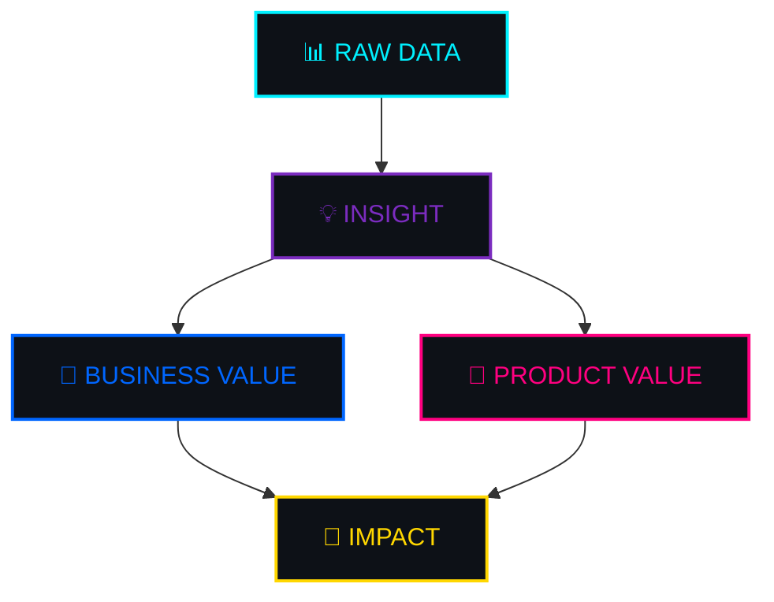

<div align="center">


<br>

<a href="https://mjshubham21-portfolio.vercel.app/"></a>
<a href="https://www.linkedin.com/in/mjshubham21"></a>
<!--  -->

<br>


</div>


<div align="center">
<br>

</div>


### 👋 Hey, I'm Shubham — nice to meet you!

✨ **Transitioning from web development into data analytics**, I fuse a builder's instinct with an analyst's curiosity to turn raw numbers into decisions people actually act on.

I live at the intersection of:

```
📊  Data & Business Intelligence
💻  Software Engineering
🤖  Generative AI
🎨  Creative Web Experiences
```

I bring a strong commercial lens to everything I build — dashboards aren't just charts, and code isn't just syntax. Both need to move the needle. 📈

<br>

<div align="center">



</div>

> 🎯 **Core Focus:** Extracting intelligence 🧠, engineering seamless applications 🌐, and weaving Generative AI 🤖 into everyday workflows.

<br clear="right"/>


<div align="center">

</div>

### 📊 Data Analytics & AI

<div align="center">


<br><br>


</div>

<br>

### 💻 Full Stack Development

<div align="center">

</div>

<br>

<div align="center">

</div>


<div align="center">


<p>Data, ideas, and caffeine ☕ — turned into things that (hopefully) matter.</p>

</div>

<table align="center" width="100%">
<tr>
<td width="50%" valign="top">

<div align="center">


### 🎬 MoviesMetrics
<sub>End-to-end movie industry analytics pipeline</sub>

<a href="https://github.com/mjshubham21/MoviesMetrics_PowerBi_Python_Project">

</a>

| | |
|---|---|
| 🎯 **Focus** | Box office & studio-level insights |
| 🧩 **Pipeline** | Data ingestion → cleaning → BI layer |
| 🛠️ **Stack** | Python · Power BI |


<a href="https://github.com/mjshubham21/MoviesMetrics_PowerBi_Python_Project">

</a>

<br>


</div>

</td>
<td width="50%" valign="top">

<div align="center">


### 📀 DVD Rental Analytics
<sub>SQL-powered business intelligence</sub>

<a href="https://github.com/mjshubham21/SQL_maven_movies_project">

</a>

| | |
|---|---|
| 🎯 **Focus** | Revenue & customer behavior |
| 🧩 **Pipeline** | Raw tables → BI-grade SQL queries |
| 🛠️ **Stack** | SQL · PostgreSQL |


<a href="https://github.com/mjshubham21/SQL_maven_movies_project">

</a>

<br>


</div>

</td>
</tr>
<tr>
<td width="50%" valign="top">

<div align="center">


### 🏡 AirBnB Insights
<sub>Exploratory analysis of listings data</sub>

<a href="https://github.com/mjshubham21/AirBnB_Python_Project">

</a>

| | |
|---|---|
| 🎯 **Focus** | Pricing patterns & location trends |
| 🧩 **Pipeline** | Cleaning → EDA → visual storytelling |
| 🛠️ **Stack** | Python · Pandas · Seaborn |


<a href="https://github.com/mjshubham21/AirBnB_Python_Project">

</a>

<br>


</div>

</td>
<td width="50%" valign="top">

<div align="center">


### 🛒 Retail Sales Analytics
<sub>Interactive retail KPI dashboard</sub>

<a href="https://github.com/mjshubham21/Retail_Sales_Analysis_Tableau_Project">

</a>

| | |
|---|---|
| 🎯 **Focus** | KPI monitoring & sales performance |
| 🧩 **Pipeline** | Excel prep → Tableau storytelling |
| 🛠️ **Stack** | Tableau · Excel |


<a href="https://github.com/mjshubham21/Retail_Sales_Analysis_Tableau_Project">

</a>

<br>


</div>

</td>
</tr>
</table>


<div align="center">


<table>
<tr><th align="left">Area</th><th align="left">What I'm doing</th></tr>
<tr><td>📊&nbsp;&nbsp;<b>Data Analytics</b></td><td>Turning messy data → meaningful insights</td></tr>
<tr><td>🤖&nbsp;&nbsp;<b>Generative AI</b></td><td>Exploring AI-powered workflows & products</td></tr>
<tr><td>🌐&nbsp;&nbsp;<b>Full Stack</b></td><td>Building useful things for the web</td></tr>
<tr><td>🧪&nbsp;&nbsp;<b>Experimenting</b></td><td>Always breaking things to understand them</td></tr>
</table>

</div>

<details>
<summary align="center"><b>🎲 Click for a random dev-fact about me</b></summary>
<br>

<div align="center">

🌙 I do my best debugging after midnight.
☕ Coffee-to-commit ratio: roughly 1:1.
📈 I've stared at more dashboards than Netflix recommendations.
🧩 Half my browser tabs are Stack Overflow. The other half is documentation I'll "read later."

</div>
</details>


<div align="center">


<p>Meet my <b>contribution snake</b> — it lives off my commit graph and only grows if I keep showing up. 🐍</p>

<picture>
  <source media="(prefers-color-scheme: dark)" srcset="https://raw.githubusercontent.com/mjshubham21/mjshubham21/output/github-contribution-grid-snake-dark.svg" />
  <source media="(prefers-color-scheme: light)" srcset="https://raw.githubusercontent.com/mjshubham21/mjshubham21/output/github-contribution-grid-snake.svg" />
  
</picture>

<sub>⚙️ Powered by a GitHub Action that re-renders the snake daily from your real contribution graph — setup file below.</sub>

</div>


<div align="center">


<br>




<br><br>


<br><br>


</div>


<div align="center">


<br>

🧠 **Think deeply.** &nbsp;&nbsp;&nbsp; 📊 **Measure everything.** &nbsp;&nbsp;&nbsp; 🚀 **Build boldly.**


</div>
